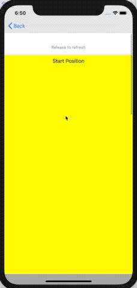
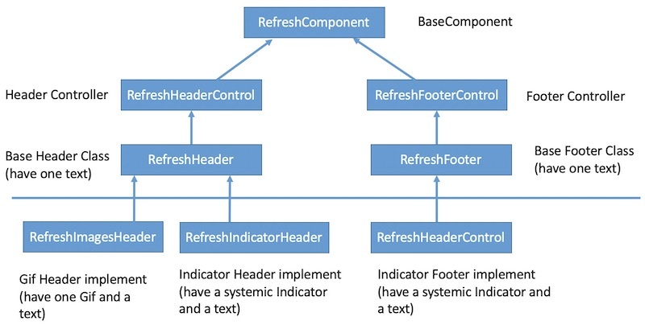

# FigRefresh

[](http://cocoapods.org/pods/FigRefresh)
[](http://cocoapods.org/pods/FigRefresh)
[](http://cocoapods.org/pods/FigRefresh)


FigRefresh is a Swift refresh framework. It's api looks like [MJRefresh](https://github.com/CoderMJLee/MJRefresh). FigRefresh is simple and extensibility.

[**中文版**](README_cn.md)



## Usage

```swift
import FigRefresh

 scrollView.fig_header = RefreshIndicatorHeader(refreshingClosure: { [weak self] in
     DispatchQueue.global().async {
        sleep(3)
        DispatchQueue.main.async {
            self?.scrollView.fig_header?.endRefreshing()
        }
    }
 })

```
look up FigRefreshDemo project in sources. 

## Design





RefreshComponent have a titleLabel property，it use show different text on various states.
I suggest you custom titleLabel in it's sub classes.

I support 3 types implements:

- 1、Text. 
- 2、Indicator + Text. 
- 3、Images + Text. 

If these can't satisfy you，Just inherit RefreshHeader and RefreshFooter class. 

```Swift

public class MyCustomHeader:RefreshHeader{
    
    //Custom UI
    var myImage:UIImageView?
    var myDetailsLabel:UILabel?
    ...


	//Return height of UI. 50 is default value
    public override func refreshComponentHeight() -> CGFloat {
        return 50
    }
    
    //Just excute once. This method used to init UI. 
    public override func refreshComponentDidMoveToSuperview() {
        //must call
        super.refreshComponentDidMoveToSuperview()
        
        //Custom styles of myImage
        //Add myImage
        addSubview(myImage)
        //Layout myImage
        ...
        
        //Custom styles of myDetailsLabel
        //Add myDetailsLabel
        addSubview(myDetailsLabel)
        //Layout myDetailsLabel
        ...
        
        //If you meed custom titleLabel
        titleLabel?.textColor = UIColor.gray
        titleLabel?.textAlignment = .left
        titleLabel!.font = UIFont.systemFont(ofSize: 13)
        
        //Option1: Layout titleLabel use constraints
//        titleLabel?.snp.remakeConstraints({ (make) in
//            make.left.equalTo(animationIV.snp.right).offset(10)
//            make.centerY.equalToSuperview()
//            make.height.equalToSuperview()
//            make.right.equalToSuperview()
//        })

        //Option2: Layout titleLabel use frame
        titleLabel?.frame = CGRect(x: animationIV.frame.maxX + 10, y: 0, width: frame.width - (animationIV.frame.maxX + 10), height: height)
        
        ...
        
    }

    
    public override  func refreshComponentStateChange(state: RefreshState) {
        super.refreshComponentStateChange(state: state)
        switch state{
        case .refreshing:  //custom style on refreshing state
            ...
            break
        default:   //custom style on idle state
            ...
            break
        }
        
    }
    
}

```

## States

FigRefresh have 6 states:

- idle: normal idel
- pullingInRect: pulling and component not displays fully
- pullingOutRect: pulling and component displays fully
- releaseing: Releaseing, not refreshing, from pullingInRect state.
- refreshing: Releaseing, and refreshing, from pullingOutRect state.
- noMoreData: no more date(only footer)

    
RefreshHeader and RefreshFooter classes，support default text on states：

```Swift

open class RefreshHeader:RefreshHeaderControl{

	...
	    
    open override func refreshComponentTitlesWithStates() -> [RefreshState : String] {
          return [.idle:"Pull down to refresh",
                 .pullingInRect:"Pull down to refresh",
                 .pullingOutRect:"Release to refresh",
                 .releaseing:"Pull down to refresh",
                 .refreshing:"Loading..."]
    }
    
}
```

```Swift

open class RefreshFooter:RefreshFooterControl{

	...
	    
    open override func refreshComponentTitlesWithStates() -> [RefreshState : String] {
        return [.idle: "Pull up to load more",
                .pullingInRect: "Pull up to load more",
                .pullingOutRect: "Release to load more",
                .releaseing:"Pull up to load more",
                .refreshing:"Loading...",
                .noMoreData:"No more data"]
    }
    
}


```

## Best Practices

### 1 、Inherit RefreshHeader and RefreshFooter.
- 1、Add new proterties.
- 1、Override refreshComponentTitlesWithStates method to custom text.
- 2、Override refreshComponentDidMoveToSuperview method to custom UI.

### 2、Set Globle Header and Footer. 

Set onec Header and Footer. 

```Swift
        
FigRefreshSetDefaultHeader(MyCustomRefreshHeader.self)
FigRefreshSetDefaultFooter(MyCustomRefreshFooter.self)
        
```
 
 call header use fig_header.
 call footer use fig_footer.
 
```Swift

scrollView.fig_header {
    DispatchQueue.global().async {  [weak self] in
        sleep(3)
        DispatchQueue.main.async {
            self?.scrollView.fig_header?.endRefreshing()
        }
    }
}
scrollView.fig_footer { [weak self] in
    DispatchQueue.global().async {
        sleep(3)
        DispatchQueue.main.async {
            self?.scrollView.fig_footer?.endRefreshing()
        }
    }
}

```

### 3 、Dynimic modify Header and Footer. 

```Swift

tableView.fig_footer?.setTitle("xxxx", for: .noMoreData) // If needed.
tableView.fig_footer?.endRefreshingWithNoMoreData()

```

### 4、use custom header or footer diffent with globles.

```Swift
 scrollView.fig_header = MyCustom2Header(refreshingClosure: { [weak self] in
     DispatchQueue.global().async {
        sleep(3)
        DispatchQueue.main.async {
            self?.scrollView.fig_header?.endRefreshing()
        }
    }
 })

```

## Requirements
- iOS 8.0+  
- Xcode 10.2
- Swift 5

## Installation

### Cocoapods

Add the following line to your Podfile:

```ruby
pod "FigRefresh"
```

## Author

Kevin Zhou

- 邮件: <wumingapie@gmail.com>
- **Twitter**: [**@wumingapie**](https://twitter.com/wumingapie)
- **Facebook**: [**wumingapie**](https://www.facebook.com/wumingapie)
- **LinkedIn**: [**Rafael**](https://www.linkedin.com/in/rafael-zhou-7230943a/)

## License

FigRefresh is available under the MIT license. See the LICENSE file for more info.
