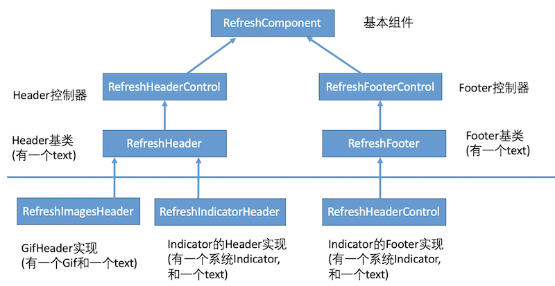

# ZKRefresh

[](http://cocoapods.org/pods/ZKRefresh)
<!--[](https://github.com/Carthage/Carthage)-->
[](http://cocoapods.org/pods/ZKRefresh)
[](http://cocoapods.org/pods/ZKRefresh)


ZKRefresh 是一个Swift刷新框架。api与[MJRefresh](https://github.com/CoderMJLee/MJRefresh)类似，但代码更加精简，扩展更加容易。

[**English Version**](README.md)


## 用法

```swift
import ZKRefresh

 scrollView.zk_header = RefreshIndicatorHeader(refreshingClosure: { [weak self] in
     DispatchQueue.global().async {
        sleep(3)
        DispatchQueue.main.async {
            self?.scrollView.zk_header?.endRefreshing()
        }
    }
 })

```
参看源码中的ZKRefreshDemo工程。

## 设计





RefreshComponent有一个titleLabel成员，用来显示不同状态的文本。
建议在子类中，修改titleLabel来达到定制化。

项目提供了3中默认实现:

- 1、Text。
- 2、Indicator + Text。
- 3、Images + Text。

如果不能满足需求，通过继承RefreshHeader和RefreshFooter即可。

```Swift

public class MyCustomHeader:RefreshHeader{
    
    //自定义UI
    var myImage:UIImageView?
    var myDetailsLabel:UILabel?
    ...


	//返回UI高度。默认是50
    public override func refreshComponentHeight() -> CGFloat {
        return 50
    }
    
    //当刷新组件被添加到父view上执行。仅执行一次。用来初始化UI。
    public override func refreshComponentDidMoveToSuperview() {
        //必须调用
        super.refreshComponentDidMoveToSuperview()
        
        //myImage定制样式
        //添加myImage
        addSubview(myImage)
        //myImage布局
        ...
        
        //myDetailsLabel定制样式
        //添加myDetailsLabel
        addSubview(myDetailsLabel)
        //myDetailsLabel布局
        ...
        
        //修改titleLabel样式
        titleLabel?.textColor = UIColor.gray
        titleLabel?.textAlignment = .left
        titleLabel!.font = UIFont.systemFont(ofSize: 13)
        
        //可选1： 使用约束，修改titleLabel布局
//        titleLabel?.snp.remakeConstraints({ (make) in
//            make.left.equalTo(animationIV.snp.right).offset(10)
//            make.centerY.equalToSuperview()
//            make.height.equalToSuperview()
//            make.right.equalToSuperview()
//        })

        //可选2：使用Frame方式，修改titleLabel布局
        titleLabel?.frame = CGRect(x: animationIV.frame.maxX + 10, y: 0, width: frame.width - (animationIV.frame.maxX + 10), height: height)
        
        ...
        
    }

    
    public override  func refreshComponentStateChange(state: RefreshState) {
        super.refreshComponentStateChange(state: state)
        switch state{
        case .refreshing:  //刷新中状态
            ...
            break
        default:   //默认状态
            ...
            break
        }
        
    }
    
}

```

## 状态

一共有如下6种刷新状态

- idle: 普通闲置状态
- pullingInRect: 手指拉动状态(header或者footer未完全显示，不满足刷新条件）
- pullingOutRect: 手指拉动状态(header或者footer已经完全显示，满足刷新条件）
- releaseing: 释放后不刷新状态(pullingInRect时候松开)
- refreshing: 释放后刷新状态(pullingOutRect时候松开)
- noMoreData: 没有更多数据(只有footer由此状态)

在RefreshHeader和RefreshFooter类中，对各个状态提供了默认文本：

```Swift

open class RefreshHeader:RefreshHeaderControl{

	...
	    
    open override func refreshComponentTitlesWithStates() -> [RefreshState : String] {
         return [.idle:"下拉刷新",
         .pullingInRect:"下拉刷新",
         .pullingOutRect:"松开刷新",
         .releaseing:"下拉刷新",
         .refreshing:"正在刷新..."]
    }
    
}
```

```Swift

open class RefreshFooter:RefreshFooterControl{

	...
	    
    open override func refreshComponentTitlesWithStates() -> [RefreshState : String] {
        return [.idle: "上拉加载更多数据",
        .pullingInRect: "上拉加载更多数据",
        .pullingOutRect: "松开加载更多数据",
        .releaseing:"上拉加载更多数据",
        .refreshing:"正在加载更多的数据...",
         .noMoreData:"已经没有更多了"]
    }
    
}


```

## 最佳实践

### 一 、写RefreshHeader,和RefreshFooter的实现类。
- 1、添加自己的UI属性。
- 1、重写refreshComponentTitlesWithStates方法，实现自定义文本。
- 2、重写refreshComponentDidMoveToSuperview方法，实现自定义UI。

### 二 、设置默认Header和Footer。

全局设置一次Header和Footer。

```Swift
        
ZKRefreshSetDefaultHeader(MyCustomRefreshHeader.self)
ZKRefreshSetDefaultFooter(MyCustomRefreshFooter.self)
        
```
 
 直接通过 zk_header 和 zk_footer创建使用，
 不再需要显示创建Header和Footer对象了。
 
```Swift

scrollView.zk_header {
    DispatchQueue.global().async {  [weak self] in
        sleep(3)
        DispatchQueue.main.async {
            self?.scrollView.zk_header?.endRefreshing()
        }
    }
}
scrollView.zk_footer { [weak self] in
    DispatchQueue.global().async {
        sleep(3)
        DispatchQueue.main.async {
            self?.scrollView.zk_footer?.endRefreshing()
        }
    }
}

```

### 三 、刷新过程中，动态修改Header和Footer。

```Swift

tableView.zk_footer?.setTitle("xxxx", for: .noMoreData) // 如果需要的话
tableView.zk_footer?.endRefreshingWithNoMoreData()

```

### 4、使用自定义的，和全局header或footer不同的view.

```Swift
 scrollView.zk_header = MyCustom2Header(refreshingClosure: { [weak self] in
     DispatchQueue.global().async {
        sleep(3)
        DispatchQueue.main.async {
            self?.scrollView.zk_header?.endRefreshing()
        }
    }
 })

```

## 硬件需求
- iOS 8.0+  
- Xcode 10.2
- Swift 5

## 安装

### Cocoapods

再Podfile文件中添加:

```ruby
pod "ZKRefresh"
```

## 作者

Kevin Zhou

- 邮件: <wumingapie@gmail.com>
- **Twitter**: [**@wumingapie**](https://twitter.com/wumingapie)
- **Facebook**: [**wumingapie**](https://www.facebook.com/wumingapie)
- **LinkedIn**: [**Rafael**](https://www.linkedin.com/in/rafael-zhou-7230943a/)

## License

ZKRefresh is available under the MIT license. See the LICENSE file for more info.
